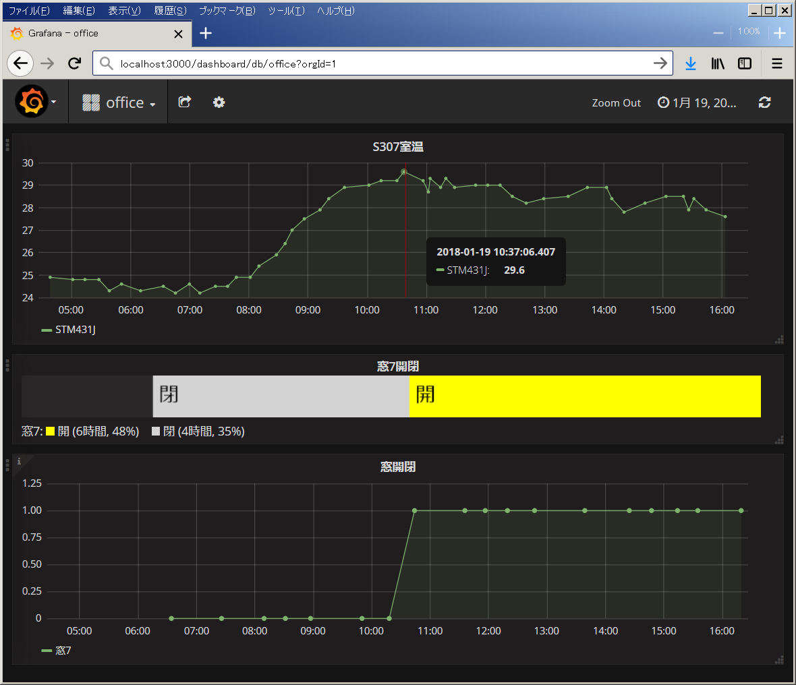
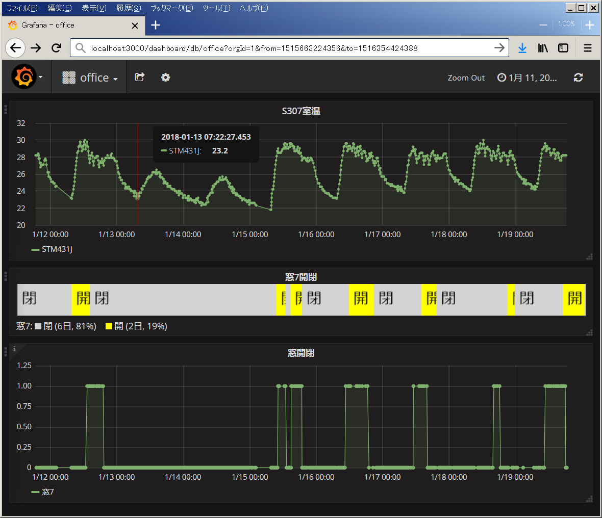
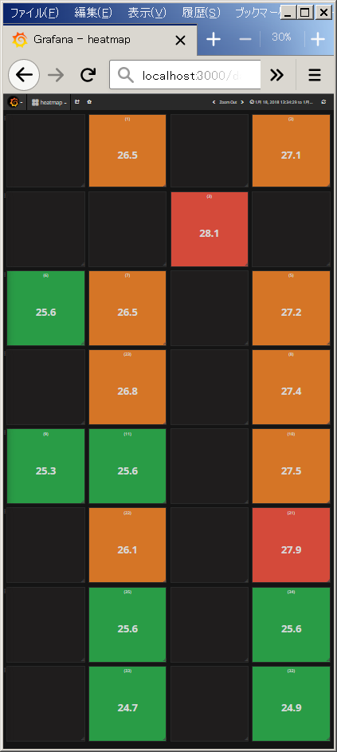

# 室温グラフ化

会社事務所の室温が暑すぎることがあるので、
室温ログをEnOceanのSTM431JやTIのSensorTagを使って記録するシステムを作りました。
Intel Edisonを、STM431J/SensorTagとInfluxDB間のgatewayとして使います。

グラフ表示にはGrafanaを使用



* 暑くて窓を開けることがあるので、窓の開閉状況と温度の関係を見れるように、
  開閉センサSTM250Jも使用

### 構成
Intel Edisonは1台で、SensorTagやSTM431J/STM250Jと接続。

#### SensorTagからInfluxDB

```
SensorTag(CC2541DK) ---[BLE]--- Intel Edison(sensortagGateway) ---[http]--- InfluxDB
```

#### STM431J/STM250JからInfluxDB

```
温度センサSTM431J ---[EnOcean]--- USB400J + Intel Edison(enoceanGateway) ---[http]--- InfluxDB
```

```
開閉センサSTM250J ---[EnOcean]--- USB400J + Intel Edison(enoceanGateway) ---[http]--- CGIスクリプトサーバ(roomwindow-publish.cgi) --- [http] --- InfluxDB/webhook通知先
```

#### Intel Edison + SensorTag
* sensortag-gateway:
  [node-sensortag](https://github.com/sandeepmistry/node-sensortag)を使用して、
  SensorTagとBLE接続して、温度・湿度を取得し、
  InfluxDBにHTTP POST。

##### Setup
```sh
cd sensortag-gateway
npm i
```

Edison起動時に自動起動するように、
sensortag.serviceファイルを、/etc/systemd/system/にコピーして、
`systemctl enable sensortag`

#### Intel Edison(USB400J) + STM431J/STM250J
* enocean-gateway:
  [node-enocean-utils](https://github.com/futomi/node-enocean-utils)を使用して、
  STM431J/STM250Jからのデータを受信し、InfluxDBやCGIスクリプトにHTTP POST。

##### Setup
```sh
cd enocean-gateway
npm i
```

使用する手元のSTM431J, STM250Jのidを、
[node-enocean-utilsに含まれるtool](https://github.com/futomi/node-enocean-utils/tree/master/tools)で調べて、
enoceanGateway.jsの該当部分を変更。

Edison起動時に自動起動するように、
enocean.serviceファイルを、/etc/systemd/system/にコピーして、
`systemctl enable enocean`

#### CGIスクリプトサーバ:窓開閉webhook実行用

* cgi-bin/roomwindow-publish.cgi: 
  * STM250Jからの開閉変化や開閉状態定期送信をEdisonが受信した時に、
    POSTする先のCGIスクリプト。
  * InfluxDBに書き込む
  * 窓開閉状態保存JSONファイルを更新
  * 窓開閉変化時に、nph-roomwindow-webhook.cgiで登録されたwebhookの呼び出し
* cgi-bin/nph-roomwindow-webhook.cgi: 
  * 窓開閉変化時のwebhook呼び出しをsubscribeしたいクライアントが
    subscribeリクエストを送る先のCGIスクリプト。
  * subscribeリクエストの形式はWebSub(旧PubSubHubbub)風。
* cgi-bin/roomwindow-hipchat.cgi: 
  * 窓開閉変化時のwebhook呼び出しを受けて、HipChatのルームにメッセージ送信するCGIスクリプト
  * 事前に手動でnph-roomwindow-webhook.cgiにリクエストを送ってsubscribe登録をしておいて使う。
  * `curl -d hub.mode=subscribe -d hub.callback=http://localhost/cgi-bin/roomwindow-hipchat.cgi http://localhost/cgi-bin/nph-roomwindow-webhook.cgi`

node.js等で書くと、それ用のサーバプロセスを起動しておく必要があって面倒なので、
Apache Webサーバから実行されるCGIスクリプトで作成。

#### hubotスクリプト
チャットの発言に反応して、
InfluxDBから現在の室温や窓開閉状態を取得して、返答するボット用スクリプト。

### 備考
* TIのSensorTagは1分間隔程度で取得を行うとCR2032電池が1週間で無くなって
  面倒なので、電池不要のSTM431Jをメインに。
* 室温は、SensorTagの赤外線温度センサの環境温度でなく、湿度センサの温度を使用。
  後者の方が約0.5℃高い。
  ガラス温度計と比較した所、後者の値の方が近かったので。

### TODO
* 窓開閉状態保存JSONファイルは、InfluxDBを直接参照する形にすれば不要
* edisonのWi-Fi接続がしばらく切断される場合あり。
  その間のデータがサーバ側に送られないままになる。
  再接続されたら、切断中のデータをまとめて送る機能を追加する。

### 付録:Grafanaでフロアのヒートマップもどき
オフィスフロアは古い全体空調なので、暑い場所と寒い場所があるようで、
他部署で温度センサ(2JCIE-BL01)を17個配置してデータを取っていて、
Webで取得できるようにしてくれているので、InfluxDBにつっこんで、
フロア内のセンサの場所と対応付けてGrafanaでヒートマップ風に表示する
ダッシュボードを作成。



フロア内のセンサ配置に対応付けて、4*8のSinglestatパネルを配置。
