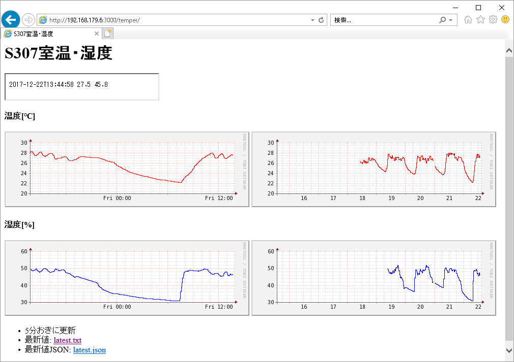

# 室温グラフ化

会社事務所の室温が暑すぎることがあるので、
室温ログをTIのSensorTagを使って記録するシステムを作りました。
Intel EdisonをSensorTagとWebサーバ間のgatewayとして使います。

ブラウザでのグラフ表示例:


構成:

```
SensorTag ---[BLE]--- Intel Edison ---[http]--- Webサーバ
```

* SensorTag CC2541DK
* Intel Edison

### 備考
* 室温は、赤外線温度センサの環境温度でなく、湿度センサの温度を使用。
  後者の方が約0.5℃高い。
  ガラス温度計と比較した所、後者の値の方が近かったので。

### TODO
* edisonのWi-Fi接続がしばらく切断される場合あり。
  その間のデータがサーバ側に送られないままになる。
  再接続されたら、切断中のデータをまとめて送る機能を追加する。
* CGIスクリプトを書き直す(現状のshell scriptは適当すぎるので)
* 1分間隔でなくrrdtool側のデータ構成に合わせて5分間隔にする。
